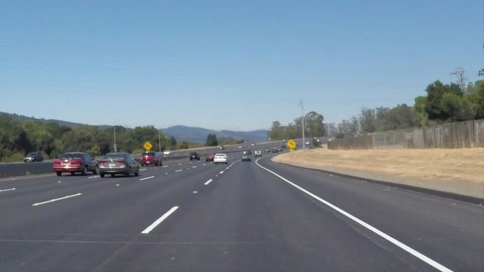
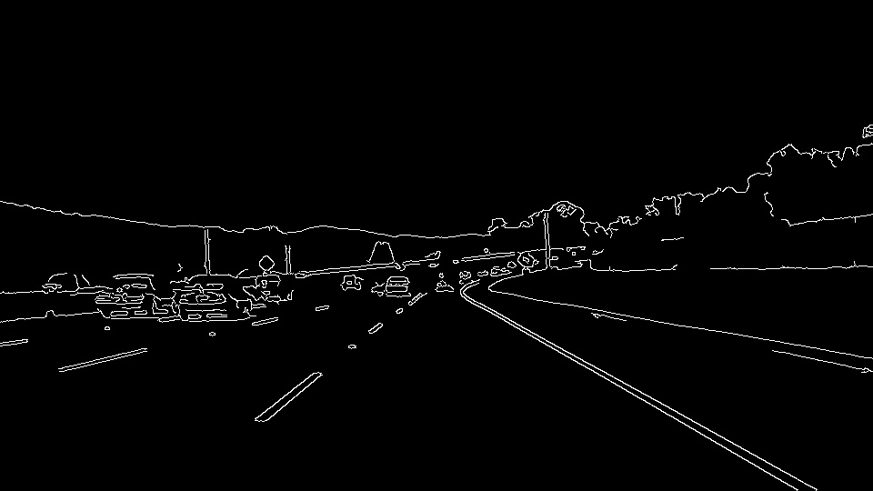
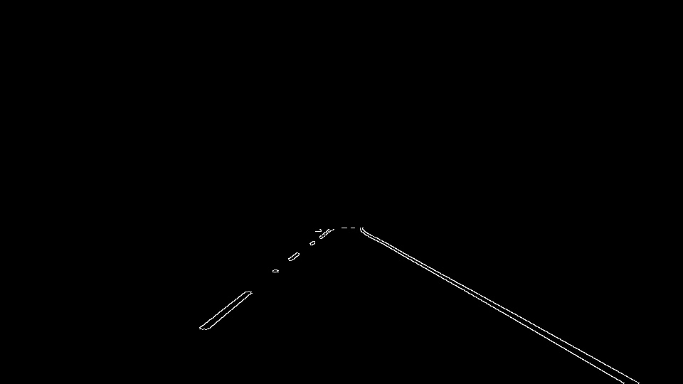
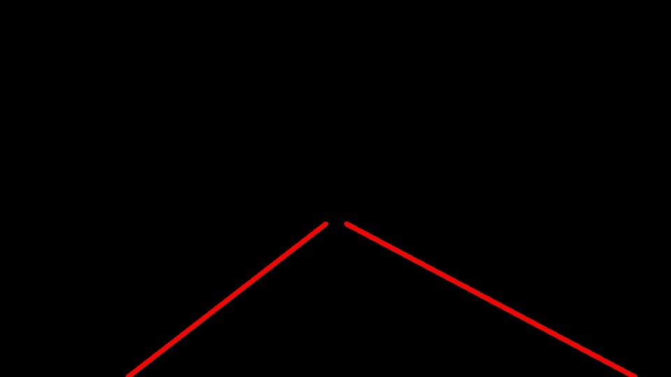
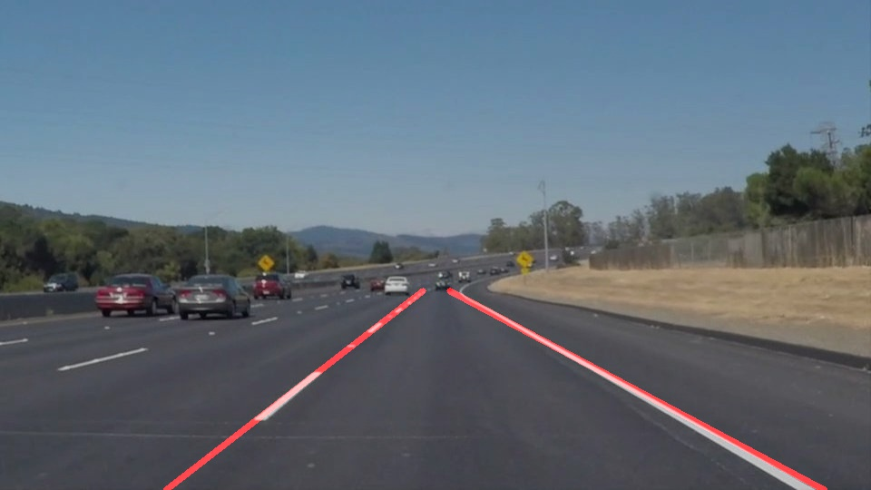

# **Finding Lane Lines on the Road** 

### 1. Describe your pipeline. As part of the description, explain how you modified the draw_lines() function.

My pipeline consisted of 5 steps. I'll take the below image for example.

* converted the images to grayscale.

* applied a Guassian filter and the canny algorithm to detect edges.

* applied a mask to filter out edges outside of target region.

* applied Hough transform to identify line segments.

* identify left and right lanes

In the last step, in order to draw a single line on the left and right lanes, I modified the draw_lines() function. I grouped line segments into two classes based on their slope and horizontal location, and used cv2.fitLine to fit them into a line, respectively.

The below figue shows identified lanes overlaying on the original image.

### 2. Identify potential shortcomings with your current pipeline

One potential problem would be that the fitting in step 5 is not suitable when lanes cannot be approximated as a line. This is true when roads have large curvature.

Another shortcoming could be that there are no enough line segments to be indentified when lanes become blurred or missing.

### 3. Suggest possible improvements to your pipeline

For the first shortcoming, we could fit lanes into a line first and evaluate the fitting error. If the error is too large, we may fit lanes into a quadratic or more compliated curve instead.

For the second shortcoming, we could utilize the identied lanes from previous times. Currently we identify lanes individually at each time. I guess it would be more stable to consider the continuity in time.